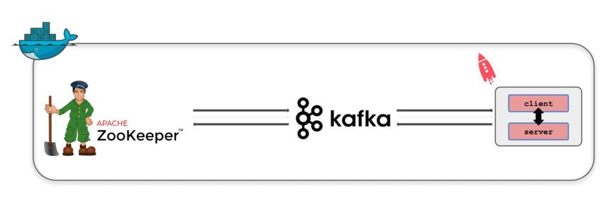

# ksqlDB-test-session
Repo that will handle some basic and practical exercises with ksqlDB

#### **Version Control**
[](https://shields.io/)
[](https://shields.io/)
[](https://shields.io/)
[](https://shields.io/)

### **1. Overview**

The idea behind this repo, is to create a testing stage for ksqlDB. A .json file will be the center of attentions on this repo, and in it we can find four data dimensions: 1) `event_v2_data`, 2) `transaction`, 3) `transaction_request`, and 4) `payment_instrument_token_data`.

We will use these dimensions to "stream them" (since it will be a python function taking care of the emulation of this streaming procedure) into 4 different streams. From that, some transformation operations will be made and also some joins in order to reach to the desired subsets of data (these will be defined in the meantime).

### **2. ksqlDB**

To this _testing stage_ we will use a Docker container with a Kafka broker installed on it, and a python wrapper to the ksqlDB API, that will allow the interaction with this tool to be more familiar and easy for a person with some knowledge on python.

Basically the Docker container used to address this challenge, comprises the following modules/images:

- **zookeeper** node: that is responsible for the maintenance of the ecosystem configurations;
- **ksqldb** client and server: these will be the main pillars of the ksql service;
- **kafka** broker: that underlying technology of the one previously mentioned.

These multiple elements highlighted above interact with eachother according to the following flow:



This will be the environment that is going to be used on all the use cases targeted.

### **3. Dependencies**

In order to keep things as "_pythonic_" as possible, we have added the the ksql module to the kafka broker. After getting access to the kafka broker console, the following command was performed

````
pip3 install ksql
````

This modifications were then committed to the kafka broker new image.

### **4. Project Tree**

This project is subdivided/organized into the following modules:

- [`/client`](/client/), where the ksql client was developed. This client leverages the python wrapper already mentioned and allows the user to perform the following actions on a ksql environment: 1) create materialized views, 2) create tables, 3) create streams, and 4) insert records. This last function can be used to insert values on tables but also on streams;

- [`/confs`](/confs/), where two configuration files can be found. The more generalistic one (`py_to_kafka.json`) is a file that essentially maps the data types from python to data types on SQL. The remaining one essentially establishes a correspondence between the .csv files provided to the .json files (that is a file type more "_ksql-friendly_") that are produced after using the `json_creator` method and the primary keys that each table/stream that must have;

- [`/images`](/images), a directory where all the images used on the documentation can be found;

- [`/notes`](/notes), a centralized unit where you can find some of the notes that I have collected during the confluent ksql courses;

- [`/use-cases`](/use-cases/), this directory essentially possesses all the uses cases that were developed to have a more practical perception of ksql capibilities. Two uses cases are on the scope:

> 1. `use-case-1` - that is essentially the data engineer challenge from Primer, but in this case we have to solve it by using ksql;

> 2. `use-case_2` [**TO BE COMPLETED**] - where the window functions capabilities are explored;

&nbsp;&nbsp;&nbsp;&nbsp;&nbsp;&nbsp; This module has also submodules, one dedicated to the queries used on the course of each use case (`/ddl`) and one to the data used in each challenge (`/data`).

- [`/utils`](/utils/), the storage unit of all the python auxiliar methods;  

### **5. Command to Trigger the ksql client**

The start the ksql client, we must use the following commmand:

````
docker exec -it ksqldb-cli ksql http://ksqldb-server:8088
````


### **A. Most used commands on the Kafka broker**

After getting access to the Kafka broker already mentioned above throughout the following command:

````
docker exec -it --priviliged --user root [BROKER_CONTAINER_ID] /bin/sh
````

The most used commands to interact with Kafka were the ones listed down below:

````
# 1. list the kafka topics
kafka-topics --bootstrap-server localhost:29092 --list

# 2. create a new kakfa topic
kafka-topics --bootstrap-server localhost:29092 --create --if-not-exists --topic [TOPIC_NAME] --replication-factor [REPLICATION_FACTOR] --partitions [PARTITIONS_NUMBER]

# 3. count the number of messages that a kafka topic possesses
kafka-run-class kafka.tools.GetOffsetShell --broker-list localhost:9092 --topic [TOPIC_NAME] --time 1 --offsets 1 | awk -F ":" '{sum += $3} END {print sum}'
````

However, some of the commands highlighted above can be avoided by using the `DESCRIBE [STREAM_NAME] EXTENDED` command, that will clearly point out the number of messages on the stream, this specifically addresses the third command. Regarding the second one, it's important to mention that the creation of kafka topics must be made entirely by the ksql.

### **B. Points to retain/reflect**

. Extraction of the data to json or csv formats came is returned in an horrible format that needs further identation;
. No comparisons with NULL values on a WHERE clause use IT NOT NULL as a comparison operator;
. Always maintain the key that's on the join expression, otherwise you will find errors;
. Stream-Stream Joins must have a WITHIN clause;
. KSQL topic is different concept than Kafka topic. KSQL topic is an internal concept for KSQL that represents a kafka topic along with metadata about that topic including the topic format. Since we do not expose KSQL topic externally you should not use it in KSQL statements. If you wanna delete a kafka topic, you should delete it from kafka. In future we plan to add topic management capability to KSQL.
. please don't delete a topic on the kafka broker before deleting a table/stream that is using it 
. whenever you want to drop a stream, please use the following command
````
DROP STREAM [STREAM_NAME] DELETE TOPIC;
````
this will also help on the topic management, which can became a bit painful in the long-run


`Author`: João Nisa

`Last update`: 26/04/2021