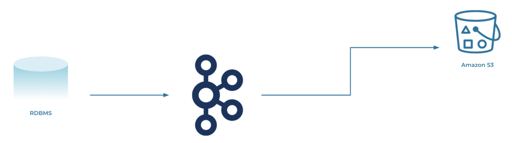

## **ksqlDB Courses Notes**

### **1. Introductory Example**

Let's consider the following query:

````
CREATE STREAM readings (sensor VARCHAR KEY, reading DOUBLE, location VARCHAR)
WITH (kakfa_topic = 'readings', value_format = 'json', partitions = '3')
````

By looking to the query above we can check that we are against a schema with three columns: `sensor`, `reading`, and `location`. The types are exactly as stated above: strings (VARCHAR) and a double. It's important to mention that the sensor is marked with the KEY keyword. <br>
There's also additional metadata: the command that specifies the underlying Kafka topic where the data will be stored (readings), along with the serialization format (JSON) and the number of partitions. But what happens internally when you issue this SQL at the ksqlDB command line? <br>
The ksqlDB servers communicate directly with your Kafka brokers. If the underlying topic doesn't exist, it gets created by Kafka. The additional metadata, like the types, gets stored in ksqlDB's object catalog. So after executing the command above, you now have a Kafka topic (called `readings`) with three empty partitions.<br>

### **2. Queries**

There are some points that are important to highlight:

- When multiple queries read the same data, we are effectively talking about having two Kafka consumers, which makes rely on them being able to process the same independently. The data that they process exists on the source Kafka topic, and Kafka trakcs the offset that each query has independently consumed. This way, you can scale the consumption data across many applications, without introducing dependencies between them;
- In traditional relational database, a materialized view speeds up queries by maintaining recalculated results of queries against an underlying table. To address this topic is important to mention what are:
> 1. **_Pull queries_** - these run against materialized views, are similar to traditional database queries in which you query your data and then get the response. They're essentially a process that starts, performs an operation, and then terminates;
> 2. **_Push queries_** - that, on the other hand, let you subscribe to a stream of updates, and then stay alive until you stop them.

### **3. `changelogs`**

Regarding `changelogs` it's important to mention that:

- Their purpose is provide redundancy in data storage and the ability to recover the state of a ksqlDB node if it were to fail;
- A replacement ksqlDB node rebuilds the state by reading from the changelog, which is durably held as a topic in Kafka;
- The state of each table is repopulated until the end of the changelog, at which point its latest state has been recovered. 
- Only the latest row by key is significant; as you replay, any earlier rows are overwritten by the later ones. This also means that changelogs don't grow indefinitely, since your data is proactively purged for you;

### **4. Joins**

Retains that:

- Joins in ksqlDB follow this MO: if there's a match between the stream and the table, a new row is created. If there is no match, the row is dropped. The updates don't cause the join to fire; only updates to the stream do so;
- If you're joining against a table or reference data, it's a good practise to preload data, so that the timestamp from your table are always smaller than the timestamps from your stream. This makes ksqlDB load the larges amount of data right at the start, and it's useful if the joined data is known ahead of time and won't change very often.

### **5. Stateful and Stateless Scaling**

Stateless Scaling, when we have a single server in a stateless scenario, it is assigned all of the partitions from the streams or tables it's reading from. Similar to the way that ksqlDB enjoys Apache Kafka consumer guarantees, when you add servers to a cluster, ksqlDB inherits the benefits of the Kafka consumer group protocol. If there is a second server to the cluster above, the work for all the partitions is now scaled out across two nodes (_a_) and (_b_). The work rebalances for you automatically, and effectivelly. ksqlDB processes the data twice as fast as it did with one server.

Stateful Scaling in ksqlDB works similarly to stateless scaling, except that in stateful scaling, state needs to be sharded across servers.

### **6. Rebooting ksqlDB**

ksqlDB does this by playing in the `changelogs`, and the process can be made fast, but it isn't immediate, so there will be inevitable downtime. To scenario can be avoided by adding more servers and configuring them for high availability. These means that if you lose servers, the remaining working nodes will be available to continue serving queries.

To making things more clear, let's look into the following example:



We know that Kafka is a distributed system, it's highly scalable and resilient. By decoupling the source from the target, and by using Kafka to do this, we gain some great benefits. <br>

If the target system goes offline, there’s no impact to the pipeline; when the target comes back online, it just resumes from where it got to before, because Kafka stores the data. If the source system goes offline, the pipeline also is unimpacted. The target doesn’t even realise that the source is down; it just sees that there’s no data. When the source comes back online, data will start to flow again. <br>

If the target system can’t keep up with the rate of data being sent to it, Kafka will take the back pressure. <br>

Since Kafka also stores data, we can send some data to multiple targets independently. 


### **7. Change Data Capture**

Change Data Capture (also known as _CDC_) enables us to capture everything already in the database, along with new changes made to the data. The are two flavours: 1) **Query-based CDC** and 2) **Log-based CDC**.

> 1. **Query-based CDC** uses a database query to pull the data from the database. It is provided by the JDBC connector for Kafka Connect, available as fully managed service in Confluent, or as self-managed connector;

> 2. **Log-based CDC** uses the database's transaction log to extract details about every change made. The particular transactions log implementation and specifics will vary by database, but all are base on the same principles. Every change made in the database is written to its transaction log. Changes can include `inserts`, `updates`, and even `deletes`. One of the several benefits of the log-based CDC is that it can capture not just what the table rows look like now, but also what <ins>they looked like before they were changed</ins>.

The main question now is: How to choose between both?

> **Query-based CDC**

> &#8593; Usually easier to set it up - since it’s just a JDBC connection to your database; <br>
> &#8593; Requires fewer permissions; <br>
> &#8595; Requires specific columns in source schema to track changes; <br>
> &#8595; Impact of polling the database (or high-latencies trade-off) - if you run the same query too often against the database you’re going to (quite rightly) have your DBA on the asking what’s going on; <br>
> &#8595; Can’t track DELETE’s; <br> 
> &#8595; Can’t track multiple events between polling interval. <br>

> **Log-based CDC**

> &#8593; Great data fidelity - since everything is captured; <br>
> &#8593; Lower latency and lower impact on the source database; <br>
> &#8595; More setup steps and higher system privileges required. <br>

#### **Additional Remarks**

- Event sourcing isn’t the only way to provide event-level storage as a system of record. Change Data Capture provides most of its benefits without altering the underlying data model;
- A CDC connector pull from the table as rows are added or changed. These are pushed into a Kafka topic, from which they can be consumed by other systems;
- The main problem of CDC records with a CDC setup is that it is not replayable like an event sourcing solution. However, this can be rectified with the outbox pattern.

### **8. Classic CRUD: Create, Read, Update, and Delete**

Let's assume that a customer of a given store buys one t-shirt, one pair of pants, and a hat. This will be translated on the presence of three records in a database, each one of them to each product. If the customer wants to add a completely new item, a new record would be added to the database, however if the customer wants to buy an already listed item (t-shirt, pants or a hat), the item could simply increase on the screen and is saved to the database.

### **9. Events**

#### **.1 Why store events?**

- **_Evidentiary_**, unlike a database table where rows are updated with new values, events simply accumulate in an event log, providing the perfect evidentiary basis for a system. This means that if something goes wrong, you can always go back and figure out why;

- **_Recoverable_**, recovery through deployability, which is particularly important for data systems. With an event-based model, the problem is simple to fix: First fix the bug, then rewind back to a point before the bug surfaced, and replay the old events. Both the software and its resulting data are repaired in one go;

- **_Insightful_**, event-level data, can be put to great use in analytics systems, whether for machine learning or for other types of analysis.

#### **.2 Event Sourcing: Create and Read only**

- Every actions that a user/customer (taking into account the previous example) makes, is preserved forever. Which means that as with CRUD, we can create and read values, but unlike CRUD, you never update a value and you never delete a value; these two destructive operations are simply not allowed with event sourcing;

- This is why event sourcing is so powerful: it retains extra data about what has happened in the world, data that the CRUD approach simply throws away.

#### **.3 Event Sourcing in Practice**

- Event sourcing with our cart example is practically accomplished as follows:

> 1. Events are stored in a table in a database, or alternatively in Apache Kafka; basically, you create a table and append events in the order that they occur; <br>
> 2. When you need to query for the latest state of the cart, you run a query that returns specific events, most likely aggregated by customer ID or session ID; <br>
> 3. You perform a chronological reduce to filter the events that are relevant for the view you’d like to serve, so a stream of five events is turned into the three records of a more traditional database table. <br>

E.g
> a. Query the events from the event - “_2 pants added to the cart_”, “_1 T-shirt added to cart_”, “_1 Pants removed from the cart_”, “_1 hat added to the cart_”, and “_User Checked out_”;
> b. Events returned - all of the above, since all the events above were created by the same user, otherwise we would filter the events to the user that has requested the checkout;
> c. Summarise, which means that form the events listed above we reduce them.

#### **.4 Event Sourcing vs Event Streaming**

> 1. CQRS with Data in Motion

Consider a flight booking system, which is very read heavy: a typical application of this kind may have 10000 more reads than writes, with users distributed all over the globe. You could use a globally distributed database, but that’s not the most efficient solution, because reads themselves will always be eventually consistent because of browser caching and other factors. What really matters is that when you book a flight, you absolutely get your reservation. This is makes sense to split up reads and writes, and have writes go to a consistent place, but have reads go somewhere that is eventually consistent;

> 2. CQRS Applied to Microservices

This pattern can also be applied to micro services. For example, by having an event source - shopping cart data - which is consumed by many others services (Fraud Service, Billing Service, and Email Service for example purposes.<br>
Each microservice has an event interface to trigger actions, as well as a view that represents the shopping cart data. Each microservice individually decides the form for the view: event level, a custom transformation, etc. The micro service also determines how the data is stored: in a relational database, a graph database, a document database, etc. 

> 3. Progressing to Event Streaming 

Event sourcing and CQRS are useful approaches for understanding the tradeoffs of event storage. But event sourcing is actually a subset of event streaming, since it only concerns a single app of micro service with a single storage model, along with a single database featuring data at rest.


### **10. Command Query Responsability Segregation**

- Reading data with event sourcing requires an additional step: you need to read all of your events in, then perform the extra step of a chronological reduce to get the current state. So you get to collect your detailed events, while the transformation step ensures that your application logic gets the data in the shape that it needs;

- There is a problem with the setup that have been discussing, occurs specially when the number of events becomes very large. Lots of events will make the reduce operation take a long time to execute and may use more clock cycles than you might be comfortable with. By using CQRS, you will perform the computations (reduce, for example) when the data is written and not it’s read. This way, each computation is performed only once, no matter how many times the data is read in the future.

#### **.1 How CQRS works?**

- Is by far the most common way that event sourcing is implemented in real-world applications, and it possesses the read and the write side:

> **_Write Side_** - we send commands or events which are stored reliably;

> **_Read Side_** - where you run queries to retrieve data (if we are using Apache Kafka, it provides the segregation between the two sides).

- Separating read from writes has some notable advantages: you get the benefit of event-level storage, but also much higher performance, since the write and read layers are decoupled. Of course, there is also a tradeoff: the system becomes eventually consistent, so a read may not be possible immediately after an event is written.

#### **.2 Implementing CQRS with Kafka**

- To implement CQRS with Kafka, you write directly to a topic, creating a log of events. The events are then pushed from Kafka into a view on the read side, from where they can be queried. Chronological reductions are performed before data is inserted into the view. If you have multiple use cases with various read requirements, it’s common to create multiple views for them, all from the same event log. To make sure that this is possible, events should be stored in an infinite retention Kafka topic so they’re available to the different use cases should the read side beed to be rebuilt, or a new view to be created from scratch.

#### **.3 CQRS vs CRUD**

- Apps evolve over time, their data models change. This leads to events with many different versions of the same schema being stored inside a single topic. As the number of schemas increases, you need to add different parsing code to allow the applications to understand each schema. This is a perfectly valid strategy for building software, but it nonetheless adds complexity to the system. CQRS system is only eventually consistent, meaning that you can’t immediately read your own writes. So basically, there is some extra complexity with CQRS. 

### **11. Outbox Pattern**

- The outbox pattern extends deployability to a CDC solution. It features a regular table that you mutate, as well an events table that is append-only. Which means that at every mutation, that features of it are immediately recorded on the events dimension;
- Storing data in Kafka rather than an outbox table works better where there are many systems that need access to the stored data; 
- The outbox pattern remains a good compromise though for simple use cases that re not performance bound.

