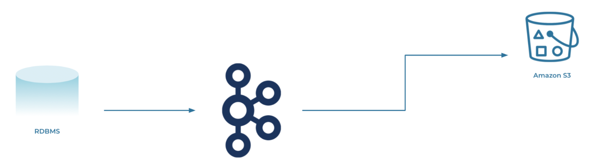

## **ksqlDB Courses Notes**

### **1. Introductory Example**

Let's consider the following query:

````
CREATE STREAM readings (sensor VARCHAR KEY, reading DOUBLE, location VARCHAR)
WITH (kakfa_topic = 'readings', value_format = 'json', partitions = '3')
````

By looking to the query above we can check that we are against a schema with three columns: `sensor`, `reading`, and `location`. The types are exactly as stated above: strings (VARCHAR) and a double. It's important to mention that the sensor is marked with the KEY keyword.
There's also additional metadata: the command that specifies the underlying Kafka topic where the data will be stored (readings), along with the serialization format (JSON) and the number of partitions. But what happens internally when you issue this SQL at the ksqlDB command line?
The ksqlDB servers communicate directly with your Kafka brokers. If the underlying topic doesn't exist, it gets created by Kafka. The additional metadata, like the types, gets stored in ksqlDB's object catalog. So after executing the command above, you now have a Kafka topic (called `readings`) with three empty partitions.

### **2. Queries**

There are some points that are important to highlight:

- When multiple queries read the same data, we are effectively talking about having two Kafka consumers, which makes rely on them being able to process the same independently. The data that they process exists on the source Kafka topic, and Kafka trakcs the offset that each query has independently consumed. This way, you can scale the consumption data across many applications, without introducing dependencies between them;
- In traditional relational database, a materialized view speeds up queries by maintaining recalculated results of queries against an underlying table. To address this topic is important to mention what are:
> 1. **_Pull queries_** - these run against materialized views, are similar to traditional database queries in which you query your data and then get the response. They're essentially a process that starts, performs an operation, and then terminates;
> 2. **_Push queries_** - that, on the other hand, let you subscribe to a stream of updates, and then stay alive until you stop them.

### **3. `changelogs`**

Regarding `changelogs` it's important to mention that:

- Their purpose is provide redundancy in data storage and the ability to recover the state of a ksqlDB node if it were to fail;
- A replacement ksqlDB node rebuilds the state by reading from the changelog, which is durably held as a topic in Kafka;
- The state of each table is repopulated until the end of the changelog, at which point its latest state has been recovered. 
- Only the latest row by key is significant; as you replay, any earlier rows are overwritten by the later ones. This also means that changelogs don't grow indefinitely, since your data is proactively purged for you;

### **4. Joins**

Retains that:

- Joins in ksqlDB follow this MO: if there's a match between the stream and the table, a new row is created. If there is no match, the row is dropped. The updates don't cause the join to fire; only updates to the stream do so;
- If you're joining against a table or reference data, it's a good practise to preload data, so that the timestamp from your table are always smaller than the timestamps from your stream. This makes ksqlDB load the larges amount of data right at the start, and it's useful if the joined data is known ahead of time and won't change very often.

### **5. Stateful and Stateless Scaling**

Stateless Scaling, when we have a single server in a stateless scenario, it is assigned all of the partitions from the streams or tables it's reading from. Similar to the way that ksqlDB enjoys Apache Kafka consumer guarantees, when you add servers to a cluster, ksqlDB inherits the benefits of the Kafka consumer group protocol. If there is a second server to the cluster above, the work for all the partitions is now scaled out across two nodes (_a_) and (_b_). The work rebalances for you automatically, and effectivelly. ksqlDB processes the data twice as fast as it did with one server.

Stateful Scaling in ksqlDB works similarly to stateless scaling, except that in stateful scaling, state needs to be sharded across servers.

### **6. Rebooting ksqlDB**

ksqlDB does this by playing in the `changelogs`, and the process can be made fast, but it isn't immediate, so there will be inevitable downtime. To scenario can be avoided by adding more servers and configuring them for high availability. These means that if you lose servers, the remaining working nodes will be available to continue serving queries.

To making things more clear, let's look into the following example:



We know that Kafka is a distributed system, it's highly scalable and resilient. By decoupling the source from the target, and by using Kafka to do this, we gain some great benefits. <br>

If the target system goes offline, there’s no impact to the pipeline; when the target comes back online, it just resumes from where it got to before, because Kafka stores the data. If the source system goes offline, the pipeline also is unimpacted. The target doesn’t even realise that the source is down; it just sees that there’s no data. When the source comes back online, data will start to flow again. <br>

If the target system can’t keep up with the rate of data being sent to it, Kafka will take the back pressure. <br>

Since Kafka also stores data, we can send some data to multiple targets independently. 


### **7. Change Data Capture**

Change Data Capture (also known as _CDC_) enables us to capture everything already in the database, along with new changes made to the data. The are two flavours: 1) **Query-based CDC** and 2) **Log-based CDC**.

> 1. **Query-based CDC** uses a database query to pull the data from the database. It is provided by the JDBC connector for Kafka Connect, available as fully managed service in Confluent, or as self-managed connector;

> 2. **Log-based CDC** uses the database's transaction log to extract details about every change made. The particular transactions log implementation and specifics will vary by database, but all are base on the same principles. Every change made in the database is written to its transaction log. Changes can include `inserts`, `updates`, and even `deletes`. One of the several benefits of the log-based CDC is that it can capture not just what the table rows look like now, but also what <ins>they looked like before they were changed</ins>.

The main question now is: How to choose between both?

> **Query-based CDC**

> &#8593; Usually easier to set it up - since it’s just a JDBC connection to your database; <br>
> &#8593; Requires fewer permissions; <br>
> &#8595; Requires specific columns in source schema to track changes; <br>
> &#8595; Impact of polling the database (or high-latencies trade-off) - if you run the same query too often against the database you’re going to (quite rightly) have your DBA on the asking what’s going on; <br>
> &#8595; Can’t track DELETE’s; <br> 
> &#8595; Can’t track multiple events between polling interval. <br>

> **Log-based CDC**

> &#8593; Great data fidelity - since everything is captured; <br>
> &#8593; Lower latency and lower impact on the source database; <br>
> &#8595; More setup steps and higher system privileges required. <br>


