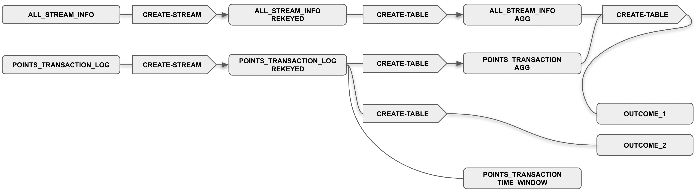

## **Use Case 2 - ksqldb Analysis**

### **1. Introduction**

This use case try to explore aggregation expressions of ksql, time window functions (and more specifically tumbling windows), and timestamp columns. To leverage this features, we have used a kaggle challenge data set that is focus on streaming advertisements in correlation with the evolution of sells. 

This kaggle data set that handles two dimensions: 1) `all_stream_info` and 2) `points_transaction_log`. The first dimension possesses data regarding all the streamed advertisements and the second one is a dataset that reflects all the sells in the same time period.

No _EDA_ was performed to get a deep understanding of the data.

With this use case we have the goal to answer to the following questions:  
1. What's the TOP 5 of the best spenders and savers? Is it possible to establish a correlation with the duration of their streaming activity? 
2. What's the difference between the best 5 spenders in a four hour interval against the worst 5? 

### **2. Resulting Flow**

At the end of the day the flow that was created to address this use case, was the following:

The flow ahead relies on the following structure points:

1. It all starts with two streams that contain the data from the two dimensions already mentioned. These streams are built with the data from json files obtained after their creation;
2. Both streams are then rekeyed, since it was noticed that this could be a point that would have a direct impact on the next steps;
3. To address some of the questions already raised on this documentation, two tables were created to handle an aggregated vision over the data streamed so far. One of this tables reflects the total duration per user spent consuming content from their TVs and, on the hand, we have a table that reflects the points spent per user;
4. To tackle the second question raised, it is crucial to have a time window applied to the second data dimension mentioned on the previous point;
5. From the tasks executed above, we were able to then apply queries that would provide the answers to the questions raised initially.

### **3. Results**

To get to the outcomes that we are looking for, we would have to perform `ORDER BY` operations, which **can not be achieved by using ksql (after all we are talking about streaming data)**. So, taking this into account, by setting up a sink connector to the ElasticSearch, we would be able to compute the operations that would allow us to compute the TOPs that we need in order to answer the questions raised. 

The ElasticSearch would need only the dimensions outcomes that are created from the flow already explained on the previous topic.

### **4. Observations**

On this section we want to highlight some of the observations during the use case execution, that deserve to be highlighted:

1. It is expected but at the same time it is interesting to check the dynamic adaption of tables and its `GROUP BY` operations as new data in the stream arrives. This was accomplished by setting a breaking point in the middle of the streaming procedure;

