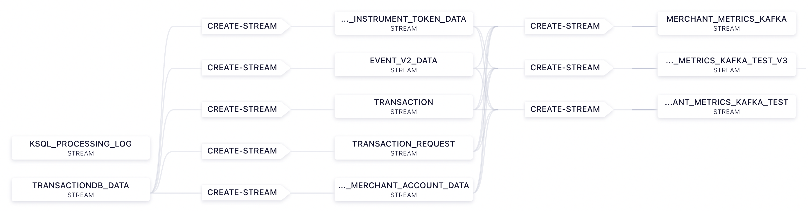

## **Use Case 3 - ksqldb Analysis**

### **1. Introduction**

On this use case, contact with the Confluent Cloud platform was made. The goal here was to join a set of ksql streams (that basically vehiculate the data from the use-case-1 but in real time to the four dimensions), all of this from a unique stream that possesses the data from four different dimensions.

Taking this into account, this use case will only highlight the queries that made us reach to the end goal and also the flow that was built from those.

### **2. Development Steps**

#### **A. _Universal_ Stream**

The first step was to create a stream that handles the data from the five different dimensions (`payment_instrument_token_data`, `event_v2_data`, `transaciton`, `transaciton_request`, and `processor_merchant_account_data`). That was accomplished by creating that stream that maps both data and metadata.

````
CREATE STREAM TRANSACTIONDB_DATA (DATA MAP<VARCHAR, VARCHAR>, METADATA MAP<VARCHAR, VARCHAR>) WITH (kafka_topic='transactiondb-cdc', partitions=6, value_format='JSON');
````

#### **B. Splitting Process**

To get individual streams to each dimensions metioned in the previous topic, we just have to use a `SELECT` statement with a filter set to compare the `metadata['table-name'] = [data_dimension]`. Taking this into account, the creation of these streams, was accomplished by using the following query:

````
CREATE STREAM TRANSACTION_REQUEST AS SELECT
    TRANSACTIONDB_DATA.DATA['flow_id'] AS FLOW_ID,
    TRANSACTIONDB_DATA.DATA['token_id'] AS TOKEN_ID,
    TRANSACTIONDB_DATA.DATA['vault_options'] AS VAULT_OPTIONS
FROM TRANSACTIONDB_DATA TRANSACTIONDB_DATA
WHERE (TRANSACTIONDB_DATA.METADATA['table-name'] = 'transaction_request')
EMIT CHANGES;
````

The example above demonstrates how the stream dedicated to the `transaction_request` data was created.

#### **C. Joining Procedure**

To get to the expected outcome, we ended up joining all the streams previously created in an unique stream throughout the following query,

````
CREATE STREAM MERCHANT_METRICS_KAFKA AS
    SELECT
        tr.transaction_id,
        ed.event_id as id,
        tr.transaction_type,
        tr.amount,
        tr.currency_code,
        ed.flow_id,
        ed.created_at,
        tr.processor_merchant_account_id,
        ed.transaction_lifecycle_event,
        ed.error_details,
        pmad.processor_id as connection_name,
        pmad.primer_account_id,
        pitd.vault_data,
        pitd.payment_instrument_type,
        request.vault_options,
        request.token_id,
        pitd.three_d_secure_authentication
    FROM
        event_v2_data ed
        LEFT JOIN TRANSACTION tr WITHIN 1 HOUR ON ed.transaction_id = tr.transaction_id
        LEFT JOIN processor_merchant_account_data pmad WITHIN 1 HOUR ON tr.processor_merchant_account_id = pmad.processor_merchant_account_id
        LEFT JOIN transaction_request request WITHIN 1 HOUR ON request.flow_id = ed.flow_id
        LEFT JOIN payment_instrument_token_data pitd WITHIN 1 HOUR ON request.token_id = pitd.token_id
        EMIT CHANGES;
````

**Note:** It's important to mention that whenever you try to join a stream, you **must** choose a time interval where the joining operation will take place.  

### **3. Resulting Flow**



**Note:** The final streams, were created to test an ElasticSearch connector.
